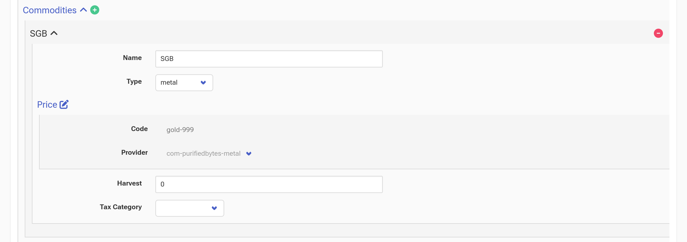

# Sovereign Gold Bond

Reserve Bank of India started issuing a new type of bond called
[Sovereign Gold Bond](https://www.rbi.org.in/commonperson/English/Scripts/FAQs.aspx?Id=1658) (SGB) in November 2015. The bond is issued by
RBI on behalf of the Government of India. Each unit of the bond is
equivalent to a gram of gold. The price of the bond is linked to the
price of the gold. The price is calculated by taking the average of
the closing price of gold of 999 purity for the last 3 business days
of the week. RBI follows the price of gold published by [IBJA](https://ibja.co/).

<!-- more -->

The bond also includes an interest component. The interest is paid
every 6 months. The initial bonds were issued with 2.75%
interest. Nowadays the interest is 2.5%. The interest is taxable as
per the income tax slab of the investor. Any capital gains on the bond
are exempted if you hold the bond till maturity. The bond has an 8
year term with an exit option available from the 5<sup>th</sup> year
onward. In this blog post, we'll explore how to use Paisa to
effectively track your SGBs and calculate your returns.

Let's assume you have `#!ledger 25,000 INR` in your bank account.

```ledger
2015/11/01 Opening Balance
    Assets:Checking:SBI           25000.00 INR
    Equity:OpeningBalance
```

Let's assume you bought 8 units of SGB issued on 26<sup>th</sup>
November 2015. The price of a single unit was `#!ledger 2684 INR`.

```ledger
2015/11/26 Buy Sovereign Gold Bond
    Assets:Gold:SGB                   8 SGB @ 2684.00 INR
    Assets:Checking:SBI       -21472.00 INR
```

If you go to the `#!ledger Assets:Gold:SGB` account, you'll see the
following


Let's add the interest component to the bond. The interest is paid on
26<sup>th</sup> of May and November every year. We need to make two
transactions entries for each interest payment. One from `#!ledger
Income:Interest:Gold:SGB` to `#!ledger Assets:Gold:SGB` and another
from `#!ledger Assets:Gold:SGB` to `#!ledger
Assets:Checking:SBI`. This is necessary to calculate the correct
returns. If you send the interest directly to your bank account, Paisa
will not be able to calculate the correct returns for `#!ledger
Income:Interest:Gold:SGB` account.

```ledger
2016/05/26 SGB Interest Credit
    Assets:Gold:SGB                    295.24 INR
    Income:Interest:Gold:SGB

2016/05/26 SGB Interest Credit
    Assets:Gold:SGB                   -295.24 INR
    Assets:Checking:SBI

2016/11/26 SGB Interest Credit
    Assets:Gold:SGB                    295.24 INR
    Income:Interest:Gold:SGB

2016/11/26 SGB Interest Withdrawal
    Assets:Gold:SGB                    -295.24 INR
    Assets:Checking:SBI

2017/05/26 SGB Interest Credit
    Assets:Gold:SGB                    295.24 INR
    Income:Interest:Gold:SGB

2017/05/26 SGB Interest Withdrawal
    Assets:Gold:SGB                    -295.24 INR
    Assets:Checking:SBI

2017/11/26 SGB Interest Credit
    Assets:Gold:SGB                    295.24 INR
    Income:Interest:Gold:SGB

2017/11/26 SGB Interest Withdrawal
    Assets:Gold:SGB                    -295.24 INR
    Assets:Checking:SBI

2018/05/26 SGB Interest Credit
    Assets:Gold:SGB                    295.24 INR
    Income:Interest:Gold:SGB

2018/05/26 SGB Interest Withdrawal
    Assets:Gold:SGB                    -295.24 INR
    Assets:Checking:SBI

2018/11/26 SGB Interest Credit
    Assets:Gold:SGB                    295.24 INR
    Income:Interest:Gold:SGB

2018/11/26 SGB Interest Withdrawal
    Assets:Gold:SGB                    -295.24 INR
    Assets:Checking:SBI

2019/05/26 SGB Interest Credit
    Assets:Gold:SGB                    295.24 INR
    Income:Interest:Gold:SGB

2019/05/26 SGB Interest Withdrawal
    Assets:Gold:SGB                    -295.24 INR
    Assets:Checking:SBI

2019/11/26 SGB Interest Credit
    Assets:Gold:SGB                    295.24 INR
    Income:Interest:Gold:SGB

2019/11/26 SGB Interest Withdrawal
    Assets:Gold:SGB                     295.24 INR
    Assets:Checking:SBI

2020/05/26 SGB Interest Credit
    Assets:Gold:SGB                     295.24 INR
    Income:Interest:Gold:SGB

2020/05/26 SGB Interest Withdrawal
    Assets:Gold:SGB                     -295.24 INR
    Assets:Checking:SBI

2020/11/26 SGB Interest Credit
    Assets:Gold:SGB                     295.24 INR
    Income:Interest:Gold:SGB

2020/11/26 SGB Interest Withdrawal
    Assets:Gold:SGB                    -295.24 INR
    Assets:Checking:SBI

2021/05/26 SGB Interest Credit
    Assets:Gold:SGB                     295.24 INR
    Income:Interest:Gold:SGB

2021/05/26 SGB Interest Withdrawal
    Assets:Gold:SGB                    -295.24 INR
    Assets:Checking:SBI

2021/11/26 SGB Interest Credit
    Assets:Gold:SGB                     295.24 INR
    Income:Interest:Gold:SGB

2021/11/26 SGB Interest Withdrawal
    Assets:Gold:SGB                    -295.24 INR
    Assets:Checking:SBI

2022/05/26 SGB Interest Credit
    Assets:Gold:SGB                     295.24 INR
    Income:Interest:Gold:SGB

2022/05/26 SGB Interest Withdrawal
    Assets:Gold:SGB                    -295.24 INR
    Assets:Checking:SBI

2022/11/26 SGB Interest Credit
    Assets:Gold:SGB                     295.24 INR
    Income:Interest:Gold:SGB

2022/11/26 SGB Interest Withdrawal
    Assets:Gold:SGB                    -295.24 INR
    Assets:Checking:SBI

2023/05/26 SGB Interest Credit
    Assets:Gold:SGB                     295.24 INR
    Income:Interest:Gold:SGB

2023/05/26 SGB Interest Withdrawal
    Assets:Gold:SGB                    -295.24 INR
    Assets:Checking:SBI

2023/11/26 SGB Interest Credit
    Assets:Gold:SGB                     295.24 INR
    Income:Interest:Gold:SGB

2023/11/26 SGB Interest Withdrawal
    Assets:Gold:SGB                    -295.24 INR
    Assets:Checking:SBI
```

The final part is the bond settlement. The debit posting includes the
buy price, buy date and the sell price. The gains come from the
capital gains account.

```ledger
2023/11/30 Withdraw Sovereign Gold Bond
    Assets:Gold:SGB                       -8 SGB {2684.00 INR} [2015/11/26] @ 6132.00 INR
    Income:CapitalGains:Gold:SGB      -27584 INR
    Assets:Checking:SBI             49056.00 INR
```

It's also possible to track the daily price[^1] of the bond. Since the
bond price is linked to the price of gold, we can use the IBJA gold
price to track the price of the bond. Go to the configuration page and
add a new commodity with the following information.



If you go to the `#!ledger Assets:Gold:SGB` account, You can find the
total returns, XIRR and the change of the bond value over time.


[^1]: The daily price history of IBJA gold price is available only
    from 2022. If you have access to the price history, you can ping
    me. Alternatively, you can manually add the [price history](../../reference/commodities.md#realestate) to the
    ledger file.
