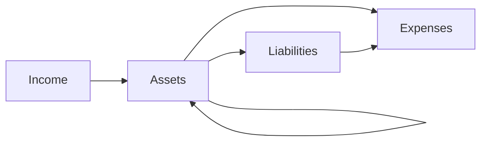

# Accounts

If you take a typical transaction, money moves between two parties. In
ledger, you call them **Account**. At least two accounts are involved
in any transaction. Accounts are also hierarchical. This helps with
the organization. For example you can treat EPF and PPF as two
accounts namely `#!ledger Assets:Debt:EPF` and `#!ledger
Assets:Debt:PPF`. The hierarchy helps you ask questions like what is
the balance of `#!ledger Assets:Debt`, which will include both EPF and
PPF.

Even though **ledger** doesn't have any strict Account naming
convention, Paisa expects you to follow the standard naming
convention.

There are four types of account namely

1. :fontawesome-solid-sack-dollar: Assets
1. :fontawesome-solid-credit-card: Liabilities
1. :fontawesome-solid-building: Income
1. :fontawesome-solid-wallet: Expenses

All the accounts you create should be under one of these
accounts. This naming convention is a necessity, because without
which, it's not possible to tell whether you are spending money or
investing money. A transaction from `#!ledger Assets` account to
`#!ledger Expenses` account implies that you are spending money.

Money typically flows from `#!ledger Income` to `#!ledger Assets`,
from `#!ledger Assets` to either `#!ledger Expenses`, `#!ledger
Liabilities` or other `#!ledger Assets`, from `#!ledger Liabilities`
to `#!ledger Expenses`.

As a general principle, try not to create too many accounts at second
level. The UI works best when you create less than or equal to 12
second level accounts under each type. For example, you can have 12
accounts under `#!ledger Expenses`. But if you want more, try to add them under
3rd level, example `#!ledger Expenses:Food:Subway`.

### Assets

All your assets should go under `#!ledger Assets:`. The level of granularity is
up to you. The recommended convention is to use
`#!ledger Assets:{instrument_type}:{instrument_name}`. The instrument type may
be `Cash`, `Equity`, `Debt`, etc. The instrument name may be the name of
the fund, stock, etc

### Checking

`#!ledger Assets:Checking` is a special account where you keep your money for
daily use. This will be included in your net worth, but will not be
treated as an investment. So gain page for example, will exclude this
account and won't show the returns. If you have multiple checking
accounts, you can use sub accounts as well, for example `#!ledger
Assets:Checking:HDFC` and `#!ledger Assets:Checking:AXIS`.

The distinction is necessary because Checking account is an asset, but
not an investment. So you ideally you want to disregard them when you
calculate your absolute returns etc.

### Income

All your income should come from `#!ledger Income:`. The typical way
is to treat each employer as a separate account like `#!ledger
Income:Salary:{company}`

### Interest

`#!ledger Income:Interest` is a special type of account from the perspective of
returns calculation. Let's assume you have bought `#!ledger APPLE` stock. You
might be buying them at regular intervals. To calculate your returns,
we can compute the difference between purchase price and current
price.

Now in case of FD, you will get your interest credited to your
account. The returns is the difference between the amount you
deposited and the final balance. It's essential we need to know which
transactions are deposits and which are interest credits.

Any money that comes from the sub account of `#!ledger
Income:Interest` will be treated as interest. This convention allows
paisa to calculate the returns of any debt instrument without
explicitly specifying anything else.

* `#!ledger Income:Interest:{name}` - interest debit account

### Tax

Income tax paid to government should be credited to `#!ledger
Expenses:Tax` account. This is used to calculate your Net Income and
your Savings Rate. If you want to track different types of taxes, you
can use sub accounts as well, for example `#!ledger Expenses:Tax:Income`
and `#!ledger Expenses:Tax:GST`.

### Expenses

All your expenses should go to `#!ledger Expenses:{category}`
accounts. You can also have more than 2 levels as well. The expense
page will roll it up to 2 level wherever necessary.

## Icons

Each account is associated with an icon and is shown along with the
account name in most places. Paisa assigns icon based on few simple
rules and it usually falls back to a generic icon. To modify the icon,
go to the configuration page, add a new Account and specify the name
of your account and then select icon of your choice. Paisa ships with
about four icon sets.

* [Arcticons](https://arcticons.onnno.nl/)
* [Font Awesome Regular, Solid and Brands](https://fontawesome.com/search?o=r&m=free&s=solid)
* [Material Design Icons](https://materialdesignicons.com/)
* [Fluent Emoji High Contrast](https://icon-sets.iconify.design/fluent-emoji-high-contrast/)

!!! example "Experimental"
    There is a wide range of free icons available, but adding each
    icon set to Paisa would increase the app binary size. So a balance
    has to be struck between the number of icons and the app
    size. Feel free to start a discussion if you feel strongly any
    icon set. The current icon sets are not final, they may be
    replaced if a better alternative is found.
