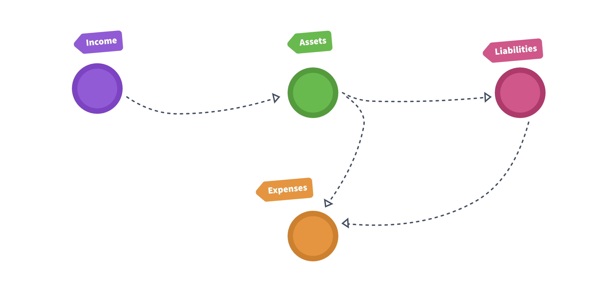

# Accounts

Even though **ledger** doesn't have any Account naming convention,
**paisa** makes lot of assumptions and expects you to follow the same
naming convention.

There are four types of account namely

1. Assets
1. Liabilities
1. Income
1. Expenses

Money flows from Income to Assets, from Assets to either Expenses,
Liabilities or other Assets, from Liabilities to Expenses.

### Checking

Your checking account should be named `Assets:Checking`.

### Assets

All your assets should go under `Assets:`. The level of granularity is
up to you. The recommended convention is to use
`Assets:{instrument_type}:{instrument_name}`. The instrument type may
be `Cash`, `Equity`, `Debt`, etc. The instrument name may be the name of
the fund, stock, etc

### Income

All your income should come from `Income:`.

* `Income:Salary:{company}` - salary debit account
* `Income:Interest:{name}` - interest debit account

### Tax

Income tax paid to government should be credited to `Expenses:Tax` account

### Expenses

All your expenses should go to `Expenses:{category}` accounts.
